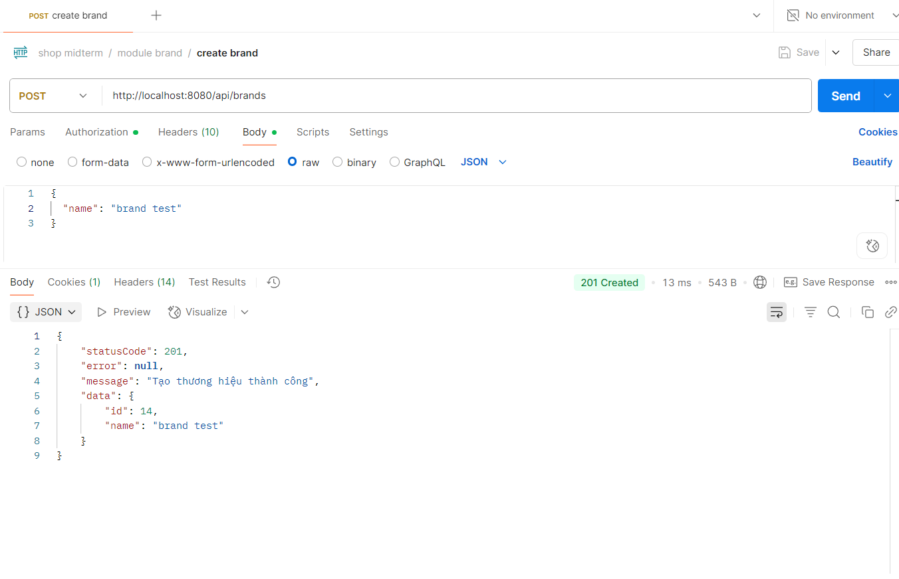

# SpringCommerce - Ứng dụng mua sắm trực tuyến MVP

## Nguyên tắc, Mẫu thiết kế và Phương pháp được áp dụng

### Nguyên tắc:
  - **SOLID**: Mỗi class/component chỉ làm một nhiệm vụ; dùng dependency injection trong Spring Boot.
  - **DRY**: Tái sử dụng code qua service và component React.
  - **KISS**: Tập trung vào MVP (lọc sản phẩm, giỏ hàng, đặt hàng).

### Mẫu thiết kế:
- **RESTful API Architecture**: Backend sử dụng Spring Boot để cung cấp các API RESTful, tách biệt với frontend React, đảm bảo giao tiếp hiệu quả qua các endpoint như `/api/products`, `/api/cart`, `/api/orders`.
- **Repository Pattern**: Sử dụng Spring Data JPA (`ProductRepository`, `OrderRepository`) để quản lý truy cập cơ sở dữ liệu MySQL một cách trừu tượng và hiệu quả.
- **Dependency Injection**: Spring Boot quản lý các bean (services, repositories) để tăng tính mô-đun và dễ kiểm thử.
- **Component-Based Architecture**: Frontend React sử dụng các component tái sử dụng như `ProductList`, `ProductCard`, `Header` để xây dựng giao diện người dùng động.

### Phương pháp được áp dụng:
- **RESTful API Design**: Các API được thiết kế theo chuẩn REST, hỗ trợ các thao tác CRUD và lọc sản phẩm theo danh mục, giá, thương hiệu.
- **Bảo mật**: Sử dụng **Spring Security** để bảo vệ các endpoint API, yêu cầu xác thực JWT cho các thao tác  như đặt hàng.
- **Kiểm thử**:
  - Backend sử dụng `spring-boot-starter-test` và `spring-security-test` để kiểm thử các chức năng.
- **Phát triển Frontend**:
  - Sử dụng **React** với `react-router-dom` để điều hướng, `axios` để gọi API, và `antd` để tạo giao diện đẹp, nhất quán.
  - **TailwindCSS** giúp xây dựng giao diện responsive nhanh chóng.
  - **Vite** được sử dụng làm công cụ build để tăng tốc phát triển và build sản phẩm.
- **Quản lý cơ sở dữ liệu**: Sử dụng MySQL với Spring Data JPA để quản lý và thao tác dữ liệu.

---

## Cấu trúc mã nguồn

Dự án được chia thành hai phần chính: **backend** (Spring Boot) và **frontend** (React). Cấu trúc mã nguồn được tổ chức như sau:

### Backend (Spring Boot)
```
src/
├── main/
│   ├── java/vn/tdtu/shop/
│   │   ├── config/          # Cấu hình Spring Boot, Spring Security
│   │   ├── controller/      # REST controllers (ProductController, OrderController, ...)
│   │   ├── domain/          # Entity classes (Product, Cart, Order, ...)
│   │   ├── repository/      # Spring Data JPA repositories
│   │   ├── service/         # Business logic (ProductService, OrderService, ...)
│   │   ├── util/            # Các lớp tiện ích hỗ trợ (SecurityUtil.java, ...)
│   │   └── ShopApplication.java  # Main class
│   └── resources/
│       ├── application.properties  # Cấu hình database, Spring
│       └── static/          # Tài nguyên tĩnh
├── test/                    # Unit tests
```

### Frontend (React)
```
src/
├── assets/                  # Hình ảnh, tài nguyên tĩnh
├── components/              # Các component React (ProductCard, Cart, SearchAndFilter, ...)
├── pages/                   # Các page (Home, ProductDetail, Orders, Products, ...)
├── App.jsx                  # Component chính
├── index.jsx                # Entry point
└── package.json             # Cấu hình dependencies và scripts
```

---

## Hướng dẫn cài đặt và chạy ứng dụng

### Yêu cầu
- **Backend**:
  - Java 17
  - Maven
  - MySQL (phiên bản 8.x)
- **Frontend**:
  - Node.js (phiên bản 18.x hoặc cao hơn)
  - npm hoặc yarn
- Máy tính có kết nối internet để tải dependencies.

### Các bước cài đặt
1. **Chuẩn bị cơ sở dữ liệu**:
   - Cài đặt MySQL và tạo database:
     ```sql
     CREATE DATABASE shop;
     ```
    - File dump dữ liệu (`shop-dump.sql`) được cung cấp trong thư mục `document/` của source code. Để nhập dữ liệu mẫu vào cơ sở dữ liệu bằng thao tác tay, bạn có thể sử dụng MySQL Workbench:
       1. Mở **MySQL Workbench** và kết nối đến server MySQL của bạn (sử dụng username và password đã cấu hình, mặc định là `root` và mật khẩu của bạn).
       2. Trong giao diện MySQL Workbench, chọn database `shop` vừa tạo (bên trái, trong danh sách schemas).
       3. Vào menu cho **Open a SQL script file in a new query tab**.
       4. Chọn file `shop_data_dump.sql` từ thư mục `document/` trong source code.
       5. Nhấn **Execute** để nhập dữ liệu. Đảm bảo không có lỗi xuất hiện trong quá trình nhập.
   - Kiểm tra thiết lập kết nối phù hợp với máy chạy code trong `src/main/resources/application.properties`:
     ```properties
     spring.datasource.url=jdbc:mysql://localhost:3306/shop
     spring.datasource.username=root
     spring.datasource.password=your_password
     spring.jpa.hibernate.ddl-auto=update
     ```

2. **Chạy backend**:
   - Clone repository:
     ```bash
     git clone https://github.com/zdat5624/java-midterm
     cd java-midterm/backend
     ```
   - Build và chạy ứng dụng Spring Boot:
     ```bash
     mvn clean install
     mvn spring-boot:run
     ```
   - Backend chạy tại `http://localhost:8080` (Nếu khác cần điều chỉnh lại thành 8080).

3. **Chạy frontend**:
   - Điều hướng đến thư mục frontend:
     ```bash
     cd java-midterm/frontend
     ```
   - Cài đặt dependencies:
     ```bash
     npm install
     ```
   - Chạy ứng dụng React:
     ```bash
     npm run dev
     ```
   - Frontend sẽ chạy tại `http://localhost:5173` (Nếu khác cần điều chỉnh lại thành 5173).

4. **Truy cập ứng dụng**:
   - Mở trình duyệt và truy cập `http://localhost:5173` để sử dụng giao diện người dùng.
   - API backend có thể được kiểm tra tại `http://localhost:8080/api`.

## Sơ đồ ERD

Sơ đồ mối quan hệ thực thể (ERD) của ứng dụng:


## Postman Snapshots to Verify the APIs

### Truy Cập Postman Collection
File `shop midterm.postman_collection.json` chứa tất cả API của ứng dụng, nằm trong thư mục `document` tại thư mục gốc của dự án. Để sử dụng:
1. Tìm file tại `document/shop midterm.postman_collection.json`.
2. Trong Postman, chọn **Import**, tải file lên và chạy các request.

### Module Product

#### 1. Tạo sản phẩm

- **Endpoint**: `POST http://localhost:8080/api/products`
- **Mô tả**: Tạo một sản phẩm mới với thông tin như tên, giá, ID thương hiệu, ID danh mục, mô tả ngắn, mô tả chi tiết và danh sách hình ảnh. Yêu cầu quyền admin (Bearer token).
- **Snapshot**: 

#### 2. Lấy sản phẩm theo ID

- **Endpoint**: `GET http://localhost:8080/api/products/{id}`
- **Mô tả**: Lấy thông tin chi tiết của một sản phẩm dựa trên ID. Không yêu cầu xác thực.
- **Snapshot**: 

#### 3. Cập nhật sản phẩm

- **Endpoint**: `PUT http://localhost:8080/api/products/{id}`
- **Mô tả**: Cập nhật thông tin của một sản phẩm hiện có (tên, giá, thương hiệu, danh mục, mô tả, hình ảnh). Yêu cầu quyền admin (Bearer token).
- **Snapshot**: 

#### 4. Xóa sản phẩm theo ID

- **Endpoint**: `DELETE http://localhost:8080/api/products/{id}`
- **Mô tả**: Xóa một sản phẩm dựa trên ID. Yêu cầu quyền admin (Bearer token).
- **Snapshot**: 

#### 5. Tìm kiếm sản phẩm với phân trang và lọc

- **Endpoint**: `GET http://localhost:8080/api/products/search?page={page}&size={size}&sort={sort}`
- **Mô tả**: Lấy danh sách sản phẩm với phân trang, sắp xếp và các bộ lọc tùy chọn (danh mục, thương hiệu, tên, giá tối thiểu, giá tối đa). Không yêu cầu xác thực.
- **Snapshot**: 

#### 6. Lấy sản phẩm tương tự

- **Endpoint**: `GET http://localhost:8080/api/products/{id}/similar?page={page}&size={size}&sort={sort}`
- **Mô tả**: Lấy danh sách các sản phẩm tương tự với sản phẩm được chỉ định bởi ID, hỗ trợ phân trang và sắp xếp. Không yêu cầu xác thực.
- **Snapshot**: 


### Module Auth

#### 1. Đăng nhập

- **Endpoint**: `POST http://localhost:8080/api/auth/login`
- **Mô tả**: Xác thực người dùng bằng tên đăng nhập (email) và mật khẩu, trả về token JWT nếu thành công. Không yêu cầu xác thực.
- **Snapshot**: 

#### 2. Lấy thông tin tài khoản bằng token

- **Endpoint**: `GET http://localhost:8080/api/auth/account`
- **Mô tả**: Lấy thông tin chi tiết của tài khoản người dùng hiện tại dựa trên token JWT. Yêu cầu xác thực bằng Bearer token.
- **Snapshot**: 

#### 3. Đăng ký

- **Endpoint**: `POST http://localhost:8080/api/auth/register`
- **Mô tả**: Đăng ký người dùng mới với thông tin như tên, số điện thoại, giới tính, email và mật khẩu. Không yêu cầu xác thực.
- **Snapshot**: 

#### 4. Gửi email quên mật khẩu

- **Endpoint**: `POST http://localhost:8080/api/auth/forgot-password`
- **Mô tả**: Gửi email chứa mã để đặt lại mật khẩu cho người dùng dựa trên email cung cấp. Không yêu cầu xác thực.
- **Snapshot**: 

#### 5. Đặt lại mật khẩu bằng mã từ email

- **Endpoint**: `POST http://localhost:8080/api/auth/reset-password`
- **Mô tả**: Đặt lại mật khẩu người dùng bằng email, mã xác nhận từ email và mật khẩu mới. Không yêu cầu xác thực.
- **Snapshot**: 

#### 6. Thay đổi mật khẩu

- **Endpoint**: `POST http://localhost:8080/api/auth/change-password`
- **Mô tả**: Thay đổi mật khẩu của người dùng hiện tại bằng cách cung cấp mật khẩu hiện tại và mật khẩu mới. Yêu cầu xác thực bằng Bearer token.
- **Snapshot**: 

### Module Cart

#### 1. Lấy giỏ hàng

- **Endpoint**: `GET http://localhost:8080/api/cart`
- **Mô tả**: Lấy thông tin giỏ hàng của người dùng hiện tại. Yêu cầu xác thực bằng Bearer token.
- **Snapshot**: 

#### 2. Thêm sản phẩm vào giỏ hàng

- **Endpoint**: `POST http://localhost:8080/api/cart/add`
- **Mô tả**: Thêm sản phẩm vào giỏ hàng với số lượng xác định. Yêu cầu xác thực bằng Bearer token.
- **Snapshot**: 

#### 3. Cập nhật số lượng sản phẩm trong giỏ hàng

- **Endpoint**: `PUT http://localhost:8080/api/cart/items/{id}`
- **Mô tả**: Cập nhật số lượng của một sản phẩm trong giỏ hàng. Yêu cầu xác thực bằng Bearer token.
- **Snapshot**: 

#### 4. Xóa sản phẩm giỏ hàng

- **Endpoint**: `DELETE http://localhost:8080/api/cart/items/{id}`
- **Mô tả**: Xóa một sản phẩm khỏi giỏ hàng dựa trên ID. Yêu cầu xác thực bằng Bearer token.
- **Snapshot**: 


### Module Order

#### 1. Tạo đơn hàng
- **Endpoint**: `POST http://localhost:8080/api/orders`
- **Mô tả**: Tạo đơn hàng mới với thông tin người nhận, địa chỉ giao hàng và số điện thoại. Yêu cầu xác thực bằng Bearer token.
- **Snapshot**: 

#### 2. Lấy danh sách đơn hàng của người dùng
- **Endpoint**: `GET http://localhost:8080/api/orders?page={page}&size={size}&sort={sort}`
- **Mô tả**: Lấy danh sách đơn hàng của người dùng hiện tại, hỗ trợ phân trang và lọc theo trạng thái. Yêu cầu xác thực bằng Bearer token.
- **Snapshot**: 

#### 3. Lấy đơn hàng theo ID
- **Endpoint**: `GET http://localhost:8080/api/orders/{id}`
- **Mô tả**: Lấy thông tin chi tiết của một đơn hàng dựa trên ID. Yêu cầu xác thực bằng Bearer token.
- **Snapshot**: 

#### 4. Cập nhật trạng thái đơn hàng (Admin)
- **Endpoint**: `PUT http://localhost:8080/api/orders/{id}/status`
- **Mô tả**: Cập nhật trạng thái đơn hàng (ví dụ: CONFIRMED, SHIPPED). Yêu cầu quyền admin (Bearer token).
- **Snapshot**: 

#### 5. Hủy đơn hàng đang chờ xử lý
- **Endpoint**: `PUT http://localhost:8080/api/orders/{id}/cancel`
- **Mô tả**: Hủy một đơn hàng đang ở trạng thái PENDING. Yêu cầu xác thực bằng Bearer token.
- **Snapshot**: 

#### 6. Lấy tất cả đơn hàng (Admin)
- **Endpoint**: `GET http://localhost:8080/api/orders/all?page={page}&size={size}&sort={sort}&status={status}&search={search}&startDate={startDate}&endDate={endDate}`
- **Mô tả**: Lấy tất cả đơn hàng với phân trang, lọc theo trạng thái, tìm kiếm và khoảng thời gian. Yêu cầu quyền admin (Bearer token).
- **Snapshot**: 

### Module Category

#### 1. Tạo danh mục

- **Endpoint**: `POST http://localhost:8080/api/categories`
- **Mô tả**: Tạo danh mục mới với tên danh mục. Yêu cầu quyền admin (Bearer token).
- **Snapshot**: 

#### 2. Lấy danh sách danh mục với phân trang

- **Endpoint**: `GET http://localhost:8080/api/categories/paged?page={page}&size={size}&sort={sort}`
- **Mô tả**: Lấy danh sách danh mục với phân trang và sắp xếp. Không yêu cầu xác thực.
- **Snapshot**: 

#### 3. Lấy danh mục theo ID

- **Endpoint**: `GET http://localhost:8080/api/categories/{id}`
- **Mô tả**: Lấy thông tin chi tiết của một danh mục dựa trên ID. Không yêu cầu xác thực.
- **Snapshot**: 

#### 4. Cập nhật danh mục

- **Endpoint**: `PUT http://localhost:8080/api/categories/{id}`
- **Mô tả**: Cập nhật tên của danh mục hiện có. Yêu cầu quyền admin (Bearer token).
- **Snapshot**: 

#### 5. Xóa danh mục theo ID

- **Endpoint**: `DELETE http://localhost:8080/api/categories/{id}`
- **Mô tả**: Xóa một danh mục dựa trên ID. Yêu cầu quyền admin (Bearer token).
- **Snapshot**: 


### Module Brand

#### 1. Tạo thương hiệu

- **Endpoint**: `POST http://localhost:8080/api/brands`
- **Mô tả**: Tạo thương hiệu mới với tên thương hiệu. Yêu cầu quyền admin (Bearer token).
- **Snapshot**: 

#### 2. Lấy danh sách thương hiệu với phân trang

- **Endpoint**: `GET http://localhost:8080/api/brands/paged?page={page}&size={size}&sort={sort}`
- **Mô tả**: Lấy danh sách thương hiệu với phân trang và sắp xếp. Không yêu cầu xác thực.
- **Snapshot**: 

#### 3. Lấy thương hiệu theo ID

- **Endpoint**: `GET http://localhost:8080/api/brands/{id}`
- **Mô tả**: Lấy thông tin chi tiết của một thương hiệu dựa trên ID. Không yêu cầu xác thực.
- **Snapshot**: 

#### 4. Cập nhật thương hiệu

- **Endpoint**: `PUT http://localhost:8080/api/brands/{id}`
- **Mô tả**: Cập nhật tên của thương hiệu hiện có. Yêu cầu quyền admin (Bearer token).
- **Snapshot**: 

#### 5. Xóa thương hiệu theo ID

- **Endpoint**: `DELETE http://localhost:8080/api/brands/{id}`
- **Mô tả**: Xóa một thương hiệu dựa trên ID. Yêu cầu quyền admin (Bearer token).
- **Snapshot**: 


### Module User

#### 1. Tạo người dùng (Admin)

- **Endpoint**: `POST http://localhost:8080/api/admin/users`
- **Mô tả**: Tạo người dùng mới với thông tin như tên, số điện thoại, email, mật khẩu, vai trò, giới tính và địa chỉ. Yêu cầu quyền admin (Bearer token).
- **Snapshot**: 

#### 2. Lấy danh sách người dùng với phân trang và lọc (Admin)

- **Endpoint**: `GET http://localhost:8080/api/admin/users?page={page}&size={size}&sortBy={sortBy}&sortDirection={sortDirection}`
- **Mô tả**: Lấy danh sách người dùng với phân trang, sắp xếp và bộ lọc (vai trò, giới tính, tìm kiếm). Yêu cầu quyền admin (Bearer token).
- **Snapshot**: 

#### 3. Lấy người dùng theo ID

- **Endpoint**: `GET http://localhost:8080/api/users/{id}`
- **Mô tả**: Lấy thông tin chi tiết của một người dùng dựa trên ID. Yêu cầu xác thực (admin hoặc user, Bearer token).
- **Snapshot**: 

#### 4. Xóa người dùng theo ID (Admin)

- **Endpoint**: `DELETE http://localhost:8080/api/admin/users/{id}`
- **Mô tả**: Xóa một người dùng dựa trên ID. Yêu cầu quyền admin (Bearer token).
- **Snapshot**: 

#### 5. Cập nhật hồ sơ người dùng

- **Endpoint**: `PUT http://localhost:8080/api/users/update-profile`
- **Mô tả**: Cập nhật thông tin hồ sơ người dùng (tên, giới tính, ảnh đại diện, số điện thoại, địa chỉ). Yêu cầu xác thực (Bearer token).
- **Snapshot**: 

#### 6. Cập nhật người dùng (Admin)

- **Endpoint**: `PUT http://localhost:8080/api/admin/users`
- **Mô tả**: Cập nhật thông tin người dùng, bao gồm vai trò. Yêu cầu quyền admin (Bearer token).
- **Snapshot**: 

## Bảo Mật với Spring Security

### Tổng Quan
Ứng dụng sử dụng **Spring Security** (dependencies: `spring-boot-starter-security`, `spring-boot-starter-oauth2-resource-server`) để:
- Xác thực JWT qua Bearer token cho API (ví dụ: `/api/admin/*`, `/api/cart/*`).
- Phân quyền dựa trên vai trò (`ADMIN`, `USER`).

### Snapshots Cấu Hình
#### 1. Cấu hình Spring Security
- Thiết lập xác thực JWT và phân quyền trong `SecurityConfig.java`.
- **Snapshot**: 


#### 2. Xác thực JWT
- Xác thực ở các mức URL, Method-Level và business logic.
- **Snapshot**:


## Unit Test Coverage

### Tổng Quan
Ứng dụng sử dụng **Spring Boot Test**, **Mockito**, và **MockMvc** để đảm bảo lượng unit test đủ cho các controller chính (`AuthController`, `CartController`, `OrderController`, `ProductController`). Các test bao phủ:
- **Xác thực và phân quyền**: Kiểm tra đăng nhập, đăng ký, đặt lại mật khẩu, và quyền truy cập dựa trên vai trò (`USER`, `ADMIN`).
- **Logic nghiệp vụ**: Test các chức năng như thêm sản phẩm vào giỏ hàng, tạo đơn hàng, cập nhật trạng thái, và tìm kiếm sản phẩm.
- **Xử lý lỗi**: Kiểm tra các trường hợp ngoại lệ (ví dụ: thông tin đăng nhập sai, sản phẩm không tồn tại).

### Snapshots Unit Test
#### 1. Test Đăng Nhập (AuthController)
- **Mô tả**: Kiểm tra đăng nhập thành công và thất bại với thông tin xác thực.
- **Snapshot**: 

#### 2. Test Giỏ Hàng (CartController)
- **Mô tả**: Kiểm tra lấy giỏ hàng, thêm/xóa sản phẩm, và cập nhật số lượng.
- **Snapshot**: 

#### 3. Test Đơn Hàng (OrderController)
- **Mô tả**: Kiểm tra tạo, hủy, cập nhật trạng thái, và lấy danh sách đơn hàng.
- **Snapshot**: 

#### 4. Test Sản Phẩm (ProductController)
- **Mô tả**: Kiểm tra tìm kiếm, tạo, cập nhật, và xóa sản phẩm.
- **Snapshot**: 

